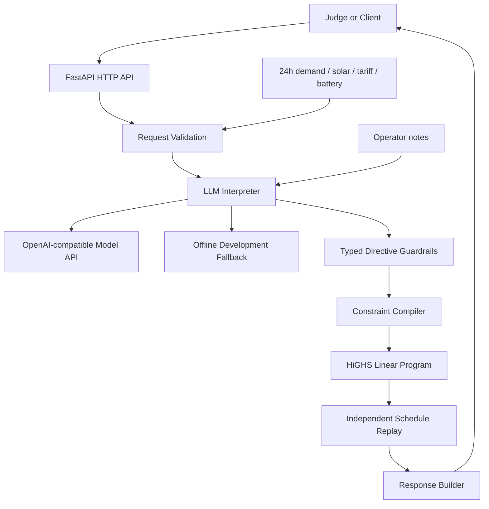

# GridWise Architecture

## Data flow

1. The request schema checks the 24-hour scenario before any model call.
2. The language model maps each note to exactly one supported directive.
3. The guardrail layer treats model output as untrusted data and validates its shape and values.
4. The compiler turns directives into effective solar values and linear-program bounds.
5. The optimizer minimizes grid cost while preserving battery neutrality.
6. Replay independently checks the candidate schedule. Only a proven schedule is serialized.

## Why this is robust

The language model never controls arithmetic or final feasibility. It supplies semantic intent; deterministic code controls interpretation validity, mathematical constraints, and final proof. This separates paraphrase handling from correctness-critical computation and keeps the hot path small enough for the latency target.
