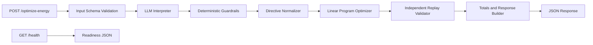

# GridWise Implementation Plan

## Goal
Build a public HTTP service for the BUP CSE Fest 2026 GridWise challenge. The service interprets 1-3 operator notes with a language model, validates the structured directives, applies them to a 24-hour battery/solar/grid model, and returns a valid minimum-cost schedule.

## Architecture

## Design decisions

1. **FastAPI** provides the exact `/health` and `/optimize-energy` contract.
2. **One LLM call per request** interprets all notes into a strict JSON intermediate representation.
3. **Deterministic guardrails** reject unsupported types, bad hours, invalid numeric values, missing notes, and invalid `applies` semantics.
4. **SciPy HiGHS linear programming** solves the continuous 24-hour energy-flow problem exactly and quickly.
5. **Replay validation** independently recalculates every battery transition, energy balance, directive, total cost, and end-of-day state before returning.
6. **Local keyword fallback** exists for local development and public sample testing when no model credentials are configured. Production judging should configure a real language-capable model through environment variables.

## Implementation phases

### Phase 1: Service foundation
- Add Python package structure.
- Add Pydantic request/response models.
- Add FastAPI endpoints and controlled error responses.

### Phase 2: Interpretation
- Define a strict model prompt and JSON contract.
- Support an OpenAI-compatible chat endpoint through environment variables.
- Add deterministic local fallback for offline development.
- Validate and normalize every model result.

### Phase 3: Optimization
- Construct a linear program with variables for grid, solar use, charge, discharge, and battery state.
- Encode solar reduction, reserve, charge/discharge windows, and grid caps as bounds.
- Minimize tariff-weighted grid import.

### Phase 4: Proof and output
- Replay the solution independently.
- Reject solver output that violates any rule.
- Recalculate totals from the returned hourly plan.
- Return the exact response schema.

### Phase 5: Verification and deployment
- Run all public sample cases.
- Test malformed requests and malformed model output.
- Build a Docker image.
- Verify `/health`, latency, and a public sample request.
- Document model configuration and fallback behavior.

## Acceptance criteria

- Exactly one interpretation entry per operator note, in order.
- All six supported directive types are supported.
- Hours are normalized to start-inclusive/end-exclusive integer ranges.
- All schedules obey balance, solar, battery, directive, rate, and neutrality rules.
- Reported totals are recalculated from the schedule.
- `/health` returns `{"status":"ok"}`.
- Public samples run reproducibly from a clean environment.
- No credentials are committed to the repository.
